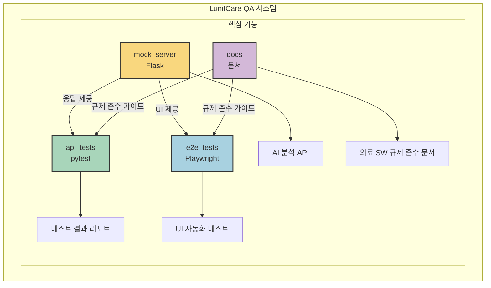
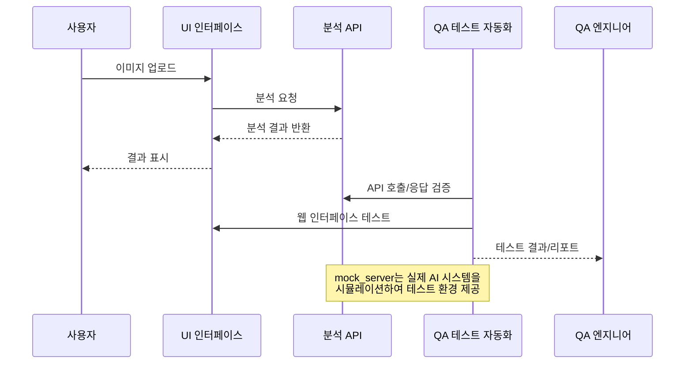

# LunitCare QA: AI 기반 암 진단 서비스 테스트 자동화 시뮬레이션

## 프로젝트 개요
본 프로젝트는 의료 AI 회사인 Lunit을 모델로 한 QA 자동화 시스템 시뮬레이션입니다. 의료 영상 분석 AI 소프트웨어의 품질 보증을 위한 다양한 테스트 프레임워크와 방법론을 구현하고 있습니다.

## 시스템 아키텍처



## 데이터 흐름



## 핵심 구성 요소

### 1. API 테스트 (`api_tests/`)
- `pytest` + `requests`를 활용한 REST API 자동화 테스트
- 다양한 이미지 입력에 대한 응답 검증
- 경계값 분석 및 오류 처리 테스트
- 성능 및 부하 테스트

### 2. E2E 테스트 (`e2e_tests/`)
- `Playwright`를 활용한 사용자 워크플로우 테스트
- 페이지 객체 모델(POM) 패턴 적용
- 다양한 의료 영상 분석 시나리오 검증
- 오류 처리 및 사용자 경험 테스트

### 3. Mock 서버 (`mock_server/`)
- `Flask` 기반의 의료 AI 분석 API 모의 시스템
- 다양한 응답 시나리오 및 오류 시뮬레이션
- 의료기기 규제 요구사항을 반영한 메타데이터 제공

### 4. 문서 (`docs/`)
- 테스트 계획 및 전략
- FDA, ISO13485 등 의료기기 규제 표준 준수 방법론
- 위험 기반 테스트 접근법

## 설치 및 실행 방법

### 필수 요구사항
- Python 3.8 이상
- Node.js 14 이상

### 설치
```bash
# Mock 서버 설치
cd mock_server
pip install -r requirements.txt

# API 테스트 설치
cd api_tests
pip install -r requirements.txt

# E2E 테스트 설치
cd e2e_tests
npm install
npx playwright install
```

### 실행
```bash
# Mock 서버 실행
cd mock_server
python app.py

# API 테스트 실행
cd api_tests
pytest -v

# E2E 테스트 실행
cd e2e_tests
npx playwright test
```

## 주요 테스트 시나리오

1. **기본 분석 워크플로우**: 의료 영상 업로드부터 AI 분석 결과 표시까지의 기본 흐름 검증
2. **정상 vs 비정상 이미지**: 다양한 의료 영상 유형에 따른 AI 분석 결과 차이 검증
3. **이미지 조작 기능**: 확대/축소, 주석 표시 등 의료 영상 검토 기능 검증
4. **보고서 생성**: 분석 결과에 대한 보고서 생성 및 다운로드 기능 검증
5. **오류 처리**: 다양한 오류 상황에 대한 시스템 대응 능력 검증

## 의료기기 규제 준수
본 프로젝트는 다음과 같은 의료기기 소프트웨어 관련 규제 및 표준을 고려하여 QA 전략을 수립하였습니다:

- FDA Software as a Medical Device (SaMD) 규정
- ISO 13485 (의료기기 품질 관리 시스템)
- IEC 62304 (의료기기 소프트웨어 생명주기)
- GDPR 및 의료정보 보호법

## 향후 개선 계획

1. **테스트 커버리지 확장**: AI 알고리즘 정확도 검증을 위한 추가 테스트 케이스 개발
2. **보안 테스트 강화**: 의료 데이터 보안 및 개인정보 보호 검증 추가
3. **성능 벤치마크**: 대용량 이미지 처리 및 동시 사용자 부하 테스트 구현
4. **CI/CD 통합**: 자동화된 테스트 파이프라인 구축
