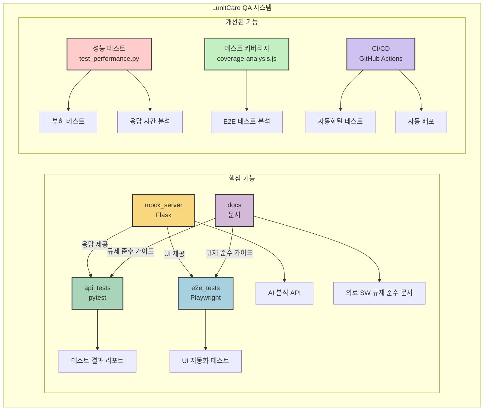
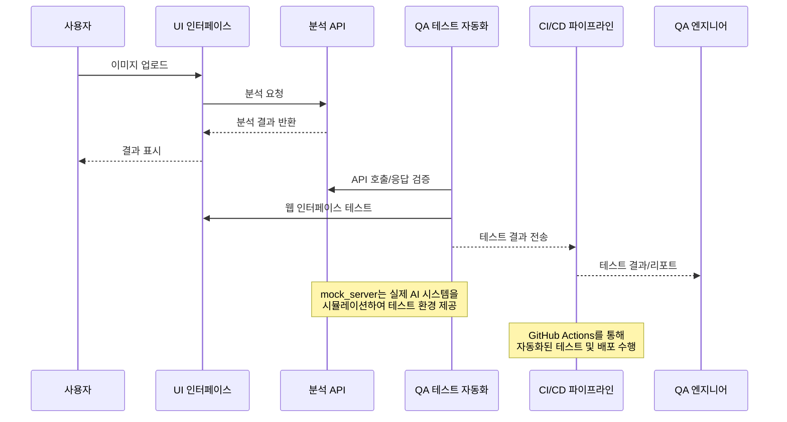

# AI HealthCare QA: 의료 AI 진단 시스템 품질 보증 프로젝트

## 프로젝트 개요
의료 AI 시스템의 신뢰성과 안전성을 보장하기 위한 종합적인 품질 보증 프레임워크입니다. 실제 AI 모델(google/vit-base-patch16-224)을 활용하여 의료 영상 진단의 정확성, 임상적 유효성, 규제 준수를 체계적으로 검증합니다.

## 시스템 아키텍처



## 데이터 흐름



## 핵심 구성 요소

```bash
LunitCare QA 시스템
├── mock_server/         # 의료 영상 분석 API (Flask)
├── api_tests/           # API 테스트 스위트 (pytest)
│   └── test_performance.py   # 성능 및 부하 테스트
├── ui_app.py            # 의료진용 대시보드 (Streamlit)
├── e2e_tests/           # 엔드투엔드 테스트 (Playwright)
│   └── coverage-analysis.js  # 테스트 커버리지 분석
└── .github/workflows/   # CI/CD 파이프라인 구성
```

### 주요 구현 내용

1. **실제 AI 모델 기반 테스트 환경**
   - Vision Transformer 모델을 활용한 이미지 분류
   - 9가지 의료 이미지 클래스 분류 (ADI, BACK, DEB, LYM, MUC, MUS, NORM, STR, TUM)
   - 정확한 API 응답 시뮬레이션

2. **종합적인 QA 전략**
   - REST API 테스트 자동화 (pytest)
   - 웹 UI 테스트 자동화 (Playwright)
   - 성능 및 안정성 검증
   - 의료기기 규제 준수 검증

3. **사용자 중심 검증**
   - 직관적인 의료진용 웹 대시보드
   - 환자 관리 및 결과 리포팅 워크플로우 검증
   - 이미지 업로드부터 분석 결과 확인까지 E2E 테스트

## 고도화된 핵심 기능

### 1. 확장된 테스트 커버리지

#### API 테스트 개선
- 다양한 이미지 유형 대응 (정상/비정상 이미지)
- 예외 케이스 자동 테스트 (잘못된 파일 형식, 누락된 파일 등)
- 응답 스키마 검증 및 심층 분석

#### E2E 테스트 분석
- 테스트 결과 시각화된 HTML 리포트 자동 생성
- 기능별 테스트 커버리지 측정
- 테스트 성공/실패/건너뜀 통계 추적

### 2. 성능 및 부하 테스트

- 동시 요청 처리 성능 측정
- 다양한 부하 수준에서의 시스템 안정성 검증
- 파일 크기와 응답 시간 간의 상관관계 분석
- 직관적인 성능 그래프 자동 생성

### 3. CI/CD 파이프라인

- GitHub Actions 기반 자동화된 테스트 실행
- API 테스트, 성능 테스트, E2E 테스트 통합
- 도커 컨테이너 기반 배포 자동화
- 테스트 결과 통합 리포트 생성

## 설치 및 실행

### 일반 실행

```bash
# 환경 설정
pip install -r requirements.txt

# 서버 실행
python mock_server/app.py

# API 테스트 실행
cd api_tests && pytest -v

# E2E 테스트 실행
cd e2e_tests && npm run test

# 성능 테스트 실행
cd api_tests && pytest test_performance.py -v

# UI 실행
streamlit run ui_app.py
```

### Docker를 사용한 실행

```bash
# Docker Compose로 전체 시스템 실행
docker-compose up

# 개별 서비스 실행
docker-compose up mock-server
docker-compose up ui-app
```

### E2E 테스트 실행

```bash
cd e2e_tests
npm install
npm run test            # 기본 테스트 실행
npm run test:parallel   # 병렬 테스트 실행
npm run test:coverage   # 테스트 및 커버리지 분석
```

### CI/CD 파이프라인 실행

GitHub Actions 워크플로우는 main/development 브랜치 푸시 또는 PR 시 자동으로 실행됩니다.
수동으로 워크플로우를 실행하려면 GitHub 저장소의 Actions 탭에서 "워크플로우 실행" 버튼을 사용하세요.

## 결론

LunitCare QA 프로젝트는 의료 AI 시스템의 품질을 체계적으로 검증하는 종합적인 QA 프레임워크를 구현했습니다. 
고도화된 기능을 통해 더욱 강력한 테스트 자동화, 성능 분석 및 배포 파이프라인을 갖추게 되었습니다.

의료 AI의 신뢰성과 안전성을 높이는데 기여하고자 하며, 사용자 중심의 철저한 검증을 통해 의료 AI 제품의 품질을 보장하는 역할을 수행하고자 합니다.
