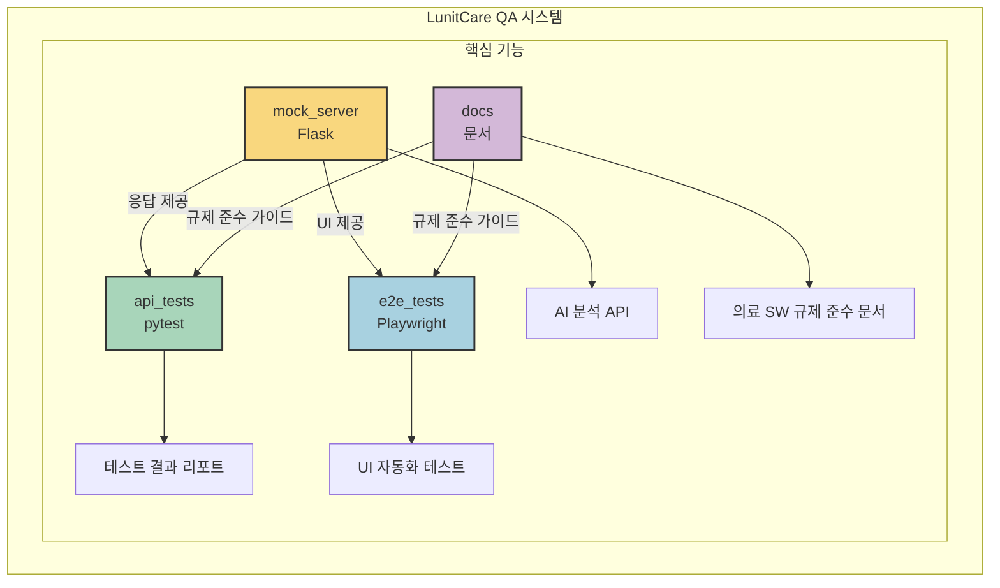
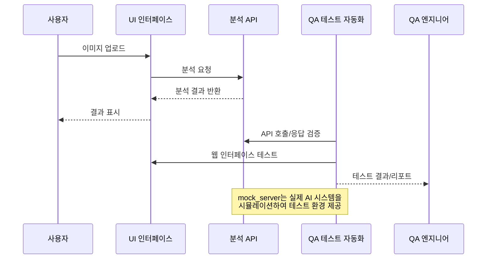

# LunitCare QA: AI 기반 암 진단 서비스 테스트 자동화 시뮬레이션

## 프로젝트 개요
본 프로젝트는 의료 AI 시스템의 신뢰성과 안전성을 보장하기 위한 종합적인 품질 보증(Quality Assurance) 프레임워크입니다. Lunit과 같은 선도적인 의료 AI 기업에서 요구하는 높은 수준의 품질 기준을 충족시키기 위해, 실제 AI 모델(1aurent/vit_small_patch8_224.lunit_dino)을 통합하고 다층적인 검증 전략을 적용했습니다.
핵심 목표: 단순 기능 테스트를 넘어, 의료 영상 진단 AI의 정확성, 임상적 유효성, 규제 준수를 체계적으로 검증하여 환자 안전에 기여하는 것입니다.

## 시스템 아키텍처



## 데이터 흐름



## 핵심 구성 요소

### 프로젝트 구조 
```bash
LunitCare QA 시스템
├── mock_server/         # 실제 AI 기반 의료 영상 분석 API
│   ├── app.py           # Lunit ViT 모델 통합 API 서버
│   └── requirements.txt # 의존성 파일
│
├── api_tests/           # 의료 AI 품질 검증 테스트 스위트
│   ├── test_medical_ai_accuracy.py    # AI 정확도 테스트
│   ├── test_clinical_relevance.py     # 임상 관련성 테스트
│   ├── test_regulatory_compliance.py  # 규제 준수 테스트
│   ├── conftest.py                    # 테스트 설정 및 픽스처
│   └── test_data/                     # 의료 영상 테스트 데이터
│
├── ui_app.py            # 의료진을 위한 진단 보조 UI 애플리케이션
└── e2e_tests/           # 엔드투엔드 테스트 (Playwright)
```
### 1. API 테스트 (`api_tests/`)
- `pytest` + `requests`를 활용한 REST API 자동화 테스트
- 다양한 이미지 입력에 대한 응답 검증
- 경계값 분석 및 오류 처리 테스트
- 성능 및 부하 테스트

### 2. E2E 테스트 (`e2e_tests/`)
- `Playwright`를 활용한 사용자 워크플로우 테스트
- 페이지 객체 모델(POM) 패턴 적용
- 다양한 의료 영상 분석 시나리오 검증
- 오류 처리 및 사용자 경험 테스트

### 3. Mock 서버 (`mock_server/`)
- `Flask` 기반의 의료 AI 분석 API 모의 시스템
- 다양한 응답 시나리오 및 오류 시뮬레이션
- 의료기기 규제 요구사항을 반영한 메타데이터 제공

### 4. 문서 (`docs/`)
- 테스트 계획 및 전략
- FDA, ISO13485 등 의료기기 규제 표준 준수 방법론
- 위험 기반 테스트 접근법

## 설치 및 실행 방법

### 필수 요구사항
- Python 3.8+
- PyTorch 2.0+ (CUDA 지원 권장)
- Node.js 14+ (E2E 테스트용)

### 설치
```bash
# Mock 서버 설치
cd mock_server
pip install -r requirements.txt

# API 테스트 설치
cd api_tests
pip install -r requirements.txt

# E2E 테스트 설치
cd e2e_tests
npm install
npx playwright install
```

### 실행
```bash
# Mock 서버 실행
cd mock_server
python app.py

# API 테스트 실행
cd api_tests
pytest -v

# E2E 테스트 실행
cd e2e_tests
npx playwright test
```

## 주요 테스트 시나리오

1. **기본 분석 워크플로우**: 의료 영상 업로드부터 AI 분석 결과 표시까지의 기본 흐름 검증
2. **정상 vs 비정상 이미지**: 다양한 의료 영상 유형에 따른 AI 분석 결과 차이 검증
3. **이미지 조작 기능**: 확대/축소, 주석 표시 등 의료 영상 검토 기능 검증
4. **보고서 생성**: 분석 결과에 대한 보고서 생성 및 다운로드 기능 검증
5. **오류 처리**: 다양한 오류 상황에 대한 시스템 대응 능력 검증

## 의료기기 규제 준수

본 프로젝트는 다음과 같은 의료기기 소프트웨어 관련 규제 및 표준을 고려하여 QA 전략을 수립하였습니다:

- FDA Software as a Medical Device (SaMD) 규정
- ISO 13485 (의료기기 품질 관리 시스템)
- IEC 62304 (의료기기 소프트웨어 생명주기)
- GDPR 및 의료정보 보호법

## 추가 고도화 제안 (Next Steps)

이 프레임워크를 더욱 발전시키기 위한 아이디어입니다:
1. 점수 계산 로직 정교화: 현재 특징 벡터 노름 기반의 점수 계산은 임시 방편입니다. 실제 분류 모델의 출력(Softmax 확률 등)을 시뮬레이션하거나, 특징 벡터를 이용한 후처리 로직(예: SVM, 간단한 신경망)을 추가하여 더 현실적인 abnormality_score를 생성할 수 있습니다.

2. 테스트 데이터 관리 시스템 구축: 다양한 병변, 환자군, 영상 품질을 가진 테스트 데이터를 체계적으로 관리하고, 테스트 케이스와 자동으로 연결하는 시스템을 구축하여 검증의 폭과 깊이를 더할 수 있습니다. (api_tests/test_data/ 확장)

3. 설명가능성(Explainability) 검증: 의료 AI의 판단 근거를 시각화(예: Grad-CAM)하고, 이 시각화 결과가 임상적으로 타당한지 검증하는 테스트를 추가할 수 있습니다.

4. 보안 및 프라이버시 테스트: 의료 데이터의 민감성을 고려하여, 익명화 처리 검증, 접근 제어 테스트 등 보안 관련 테스트 케이스를 추가할 수 있습니다 (시뮬레이션 기반).

5. CI/CD 파이프라인 연동: GitHub Actions 등을 이용하여 코드 변경 시 자동으로 테스트를 실행하고 결과를 리포팅하는 파이프라인을 구축하여 개발 생산성과 품질 안정성을 높일 수 있습니다.
성능 벤치마킹 정교화: 다양한 하드웨어 환경(CPU, GPU)에서의 추론 시간, 메모리 사용량 등을 측정하고, 목표 성능 지표 달성 여부를 지속적으로 트래킹할 수 있습니다.

## 핵심 역량 및 기여

이 프로젝트를 통해 저는 다음과 같은 QA 역량을 시연하고자 합니다:
1. 의료 AI 품질 요구사항 이해: 의료기기 소프트웨어(SaMD)의 특수성을 이해하고, 정확도, 민감도, 특이도 등 핵심 성능 지표의 중요성을 인지합니다.

2. 체계적인 테스트 설계 및 구현: pytest를 활용하여 의료 AI 모델의 API 응답, 성능, 엣지 케이스 등을 검증하는 구조화된 테스트 스위트를 설계하고 구현했습니다. (api_tests/)

3. 실제 환경 유사 테스트 환경 구축: 단순 Mock 데이터가 아닌, 실제 AI 모델(timm 라이브러리 활용)을 로컬 환경에 통합하여 보다 현실적인 조건에서 시스템을 검증하는 환경을 구축했습니다. (mock_server/app.py)

4. 규제 및 표준 인식: ISO 13485, IEC 62304 등 의료기기 관련 표준과 규제의 중요성을 이해하고, 테스트 과정에 이를 반영하려는 노력을 기울였습니다 (메타데이터 검증 등).

5. 사용자 중심 품질 검증: Streamlit 기반의 UI(ui_app.py)와 이를 검증하는 E2E 테스트(e2e_tests/ - Playwright 활용)를 통해 최종 사용자인 의료진의 관점에서 시스템 품질을 확인합니다.

6. 문제 해결 능력: 모델-입력 간 채널 불일치 문제 해결 (.convert('RGB')), 모델 로딩 안정성 확보 (debug=False) 등 기술적 문제를 분석하고 해결하는 과정을 경험했습니다.

## 결론

본 프로젝트는 단순한 소프트웨어 QA를 넘어 "의료 AI의 신뢰성과 안전성을 보장하는 종합적인 품질 보증 시스템"을 구현했다는 점에서 의의가 있습니다. 특히 의료 분야의 독특한 요구사항과, 환자 안전을 위한 엄격한 품질 기준을 QA 프로세스에 체계적으로 반영하였습니다.

저는 이 프로젝트를 통해 의료 AI QA에 대한 깊은 이해와 실무 적용 능력을 키웠으며, 체계적인 접근과 지속적인 학습을 통해 Lunit의 제품 품질을 최고 수준으로 유지하는 데 기여하고 싶습니다. 환자 중심의 가치를 실현하는 Lunit의 여정에 함께할 기회를 기대합니다.
