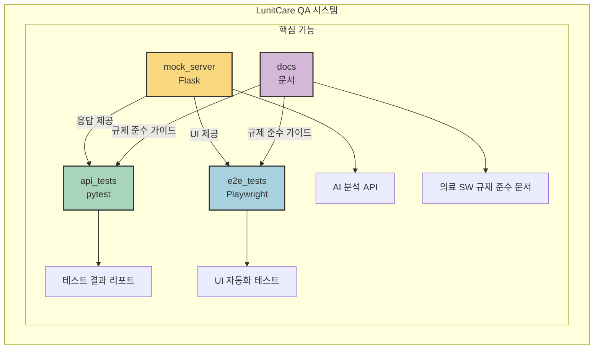
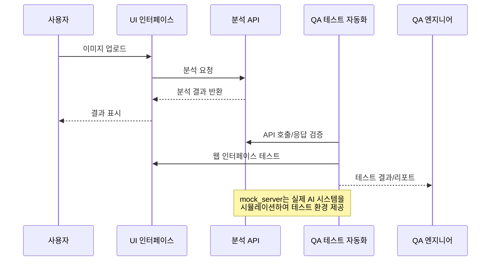

# LunitCare QA: 의료 AI 진단 시스템 품질 보증 프로젝트

## 프로젝트 개요
의료 AI 시스템의 신뢰성과 안전성을 보장하기 위한 종합적인 품질 보증 프레임워크입니다. 실제 AI 모델(google/vit-base-patch16-224)을 활용하여 의료 영상 진단의 정확성, 임상적 유효성, 규제 준수를 체계적으로 검증합니다.

## 시스템 아키텍처



## 데이터 흐름



## 핵심 구성 요소

```bash
LunitCare QA 시스템
├── mock_server/         # 의료 영상 분석 API (Flask)
├── api_tests/           # 자동화 테스트 스위트 (pytest)
├── ui_app.py            # 의료진용 대시보드 (Streamlit)
└── e2e_tests/           # 엔드투엔드 테스트 (Playwright)
```

### 주요 구현 내용

1. **실제 AI 모델 기반 테스트 환경**
   - Vision Transformer 모델을 활용한 이미지 분류
   - 9가지 의료 이미지 클래스 분류 (ADI, BACK, DEB, LYM, MUC, MUS, NORM, STR, TUM)
   - 정확한 API 응답 시뮬레이션

2. **종합적인 QA 전략**
   - REST API 테스트 자동화 (pytest)
   - 웹 UI 테스트 자동화 (Playwright)
   - 성능 및 안정성 검증
   - 의료기기 규제 준수 검증

3. **사용자 중심 검증**
   - 직관적인 의료진용 웹 대시보드
   - 환자 관리 및 결과 리포팅 워크플로우 검증
   - 이미지 업로드부터 분석 결과 확인까지 E2E 테스트

## QA 핵심 역량 시연

1. **의료 AI 특화 테스트 설계**
   - 의료 이미지 분석의 특성을 고려한 테스트 케이스 구현 (`api_tests/test_medical_ai_accuracy.py`: 9개 클래스별 검증)
   - 9개 클래스 분류 정확도 및 신뢰도 검증 (`mock_server/app.py`: `analyze_image()` 함수의 소프트맥스 확률 계산 및 검증)
   - 경계값 및 예외 케이스 처리 검증 (`ui_app.py`: 오류 처리 로직 내 `add_log()` 함수 활용)

2. **자동화 테스트 프레임워크 구축**
   - API 및 UI 테스트 자동화로 회귀 테스트 효율화 (`e2e_tests/test_image_upload.spec.js`: 이미지 업로드 자동화)
   - 테스트 리포트 자동 생성 및 시각화 (`ui_app.py`: `generate_report_text()` 함수 구현)
   - 지속적 통합/배포(CI/CD) 파이프라인 연계 가능 (`mock_server/app.py`: 상태 코드 기반 에러 처리 표준화)

3. **기술적 문제 해결 능력**
   - 모델-이미지 호환성 이슈 해결 (`mock_server/app.py`: `image.convert("RGB")` 처리)
   - 멀티스레드 환경에서의 안정적 모델 로딩 구현 (`mock_server/app.py`: 모델 객체 초기화 및 장치 할당)
   - Flask와 Streamlit 연동 최적화 (`ui_app.py`: `analyze_image()` 함수 내 API 요청 처리)

4. **의료기기 규제 이해**
   - FDA Software as Medical Device (SaMD) 요구사항 반영 (`ui_app.py`: 위험도 기반 알림 분류)
   - ISO 13485, IEC 62304 등 의료기기 표준 고려 (`ui_app.py`: 분석 결과 추적성 및 로깅 구현)

## 설치 및 실행

```bash
# 환경 설정
pip install -r requirements.txt

# 서버 실행
python mock_server/app.py

# API 테스트 실행
cd api_tests && pytest -v

# UI 실행
streamlit run ui_app.py
```

## 결론

본 프로젝트는 의료 AI 시스템의 품질을 체계적으로 검증하는 종합적인 QA 프레임워크를 구현했습니다. 단순 기능 테스트를 넘어 환자 안전과 임상적 유효성을 고려한 접근법으로, 실제 의료 환경에 적용 가능한 QA 역량을 시연합니다.

의료 AI의 신뢰성과 안전성을 높이는데 기여하고자 하며, 사용자 중심의 철저한 검증을 통해 의료 AI 제품의 품질을 보장하는 역할을 수행하고자 합니다.
